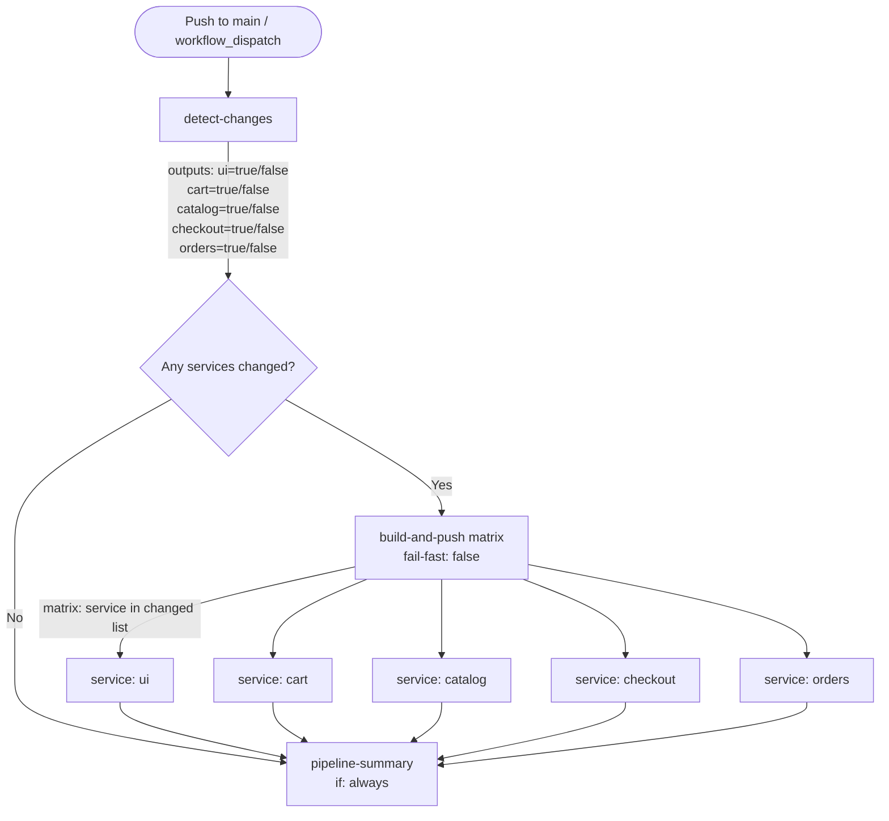

# Design Document: GitHub Actions CI/CD Pipeline

## Overview

This document describes the technical design of a GitHub Actions CI/CD pipeline for the retail-store-sample-app. The pipeline automates three responsibilities for each push to `main`:

1. **Change Detection** — determine which of the five microservices (`ui`, `cart`, `catalog`, `checkout`, `orders`) have modified source files.
2. **Image Build & Push** — build a Docker image for each changed service and push it to Amazon ECR, tagged with the short commit SHA.
3. **Helm Values Update** — update the `image.tag` field in `src/<service>/chart/values.yaml` and commit the change so ArgoCD can detect and deploy the new image automatically.

The workflow is contained in a single file: `.github/workflows/ci.yml`. It uses a detect-then-matrix pattern where a `detect-changes` job fans out to a parallel matrix `build-and-push` job, followed by a `pipeline-summary` job that always runs and collects outcomes.

---

## Architecture

### Job Chain



### Key Design Decisions

| Decision | Choice | Rationale |
|---|---|---|
| Change detection | `dorny/paths-filter@v3` | Mature action with per-path outputs, supports `workflow_dispatch` override |
| Matrix construction | `fromJson` expression on a JSON array built from filter outputs | GitHub Actions native; no extra steps or actions needed |
| Image tagging | `${{ github.sha }}` first 7 chars via `${GITHUB_SHA::7}` | Short SHA is a standard convention; uniquely identifies the commit |
| Helm values update | `sed -i` targeting only the `tag:` line under `image:` | Available on all GitHub-hosted runners; `yq` would require installation |
| Commit loop prevention | Workflow-level `if:` condition on HEAD commit message | Checked before any job runs; simpler and more reliable than per-job checks |
| Concurrency | `concurrency` group per branch with `cancel-in-progress: true` | Ensures only the latest push is built when several arrive rapidly |

---

## Workflow File Structure

**File:** `.github/workflows/ci.yml`

```yaml
name: CI/CD Pipeline

on:
  push:
    branches:
      - main
  workflow_dispatch:

concurrency:
  group: ci-${{ github.ref }}
  cancel-in-progress: true

permissions:
  contents: write

jobs:
  detect-changes:
    # ...

  build-and-push:
    needs: detect-changes
    strategy:
      fail-fast: false
      matrix:
        service: ${{ fromJson(needs.detect-changes.outputs.matrix) }}
    # ...

  pipeline-summary:
    needs: [detect-changes, build-and-push]
    if: always()
    # ...
```

The top-level `if:` on the workflow (or on `detect-changes`) uses:

```yaml
if: "!contains(github.event.head_commit.message, '[skip ci]')"
```

This prevents any job from running when the triggering commit was generated by the Helm_Updater.

---

## Components and Interfaces

### Job: detect-changes

**Purpose:** Identify which services have changed files and expose them as outputs consumed by the matrix build job.

**Inputs:** The GitHub event context (changed files list, trigger event type).

**Outputs:**
- `ui`, `cart`, `catalog`, `checkout`, `orders` — string `'true'` or `'false'`
- `matrix` — JSON array string of service names to build, e.g. `'["ui","cart"]'`

**Implementation:**

Uses `dorny/paths-filter@v3` to declare per-service path filters. For `workflow_dispatch`, the action's `base` can be set to emit all filters as changed, or the matrix can be overridden inline using a conditional expression.

```yaml
- name: Detect changed services
  id: filter
  uses: dorny/paths-filter@v3
  with:
    filters: |
      ui:
        - 'src/ui/**'
      cart:
        - 'src/cart/**'
      catalog:
        - 'src/catalog/**'
      checkout:
        - 'src/checkout/**'
      orders:
        - 'src/orders/**'
```

For `workflow_dispatch`, all services must be treated as changed. The matrix is built by a subsequent step:

```yaml
- name: Build changed-services matrix
  id: set-matrix
  run: |
    if [ "${{ github.event_name }}" = "workflow_dispatch" ]; then
      echo 'matrix=["ui","cart","catalog","checkout","orders"]' >> "$GITHUB_OUTPUT"
    else
      SERVICES=()
      [ "${{ steps.filter.outputs.ui }}" = "true" ]       && SERVICES+=("ui")
      [ "${{ steps.filter.outputs.cart }}" = "true" ]     && SERVICES+=("cart")
      [ "${{ steps.filter.outputs.catalog }}" = "true" ]  && SERVICES+=("catalog")
      [ "${{ steps.filter.outputs.checkout }}" = "true" ] && SERVICES+=("checkout")
      [ "${{ steps.filter.outputs.orders }}" = "true" ]   && SERVICES+=("orders")

      if [ ${#SERVICES[@]} -eq 0 ]; then
        echo 'matrix=[]' >> "$GITHUB_OUTPUT"
      else
        MATRIX=$(printf '"%s",' "${SERVICES[@]}" | sed 's/,$//')
        echo "matrix=[${MATRIX}]" >> "$GITHUB_OUTPUT"
      fi
    fi
```

**Step Summary Output:**

```yaml
- name: Write detection summary
  run: |
    echo "## Change Detection" >> "$GITHUB_STEP_SUMMARY"
    echo "- Trigger: ${{ github.event_name }}" >> "$GITHUB_STEP_SUMMARY"
    echo "- Commit: ${{ github.sha }}" >> "$GITHUB_STEP_SUMMARY"
    echo "- UTC: $(date -u)" >> "$GITHUB_STEP_SUMMARY"
    if [ '${{ steps.set-matrix.outputs.matrix }}' = '[]' ]; then
      echo "No services changed" >> "$GITHUB_STEP_SUMMARY"
    else
      echo "Changed services: ${{ steps.set-matrix.outputs.matrix }}" >> "$GITHUB_STEP_SUMMARY"
    fi
```

---

### Job: build-and-push (matrix)

**Purpose:** For each changed service, authenticate to AWS, build and push the Docker image to ECR, update the Helm values file, and commit the change.

**Depends on:** `detect-changes`

**Matrix:** `service` iterates over the JSON array from `detect-changes.outputs.matrix`.

**`fail-fast: false`** — one failing service must not cancel builds for other services.

#### Step: Validate required secrets

```yaml
- name: Validate required secrets
  run: |
    MISSING=""
    [ -z "${{ secrets.AWS_ACCESS_KEY_ID }}" ]     && MISSING="$MISSING AWS_ACCESS_KEY_ID"
    [ -z "${{ secrets.AWS_SECRET_ACCESS_KEY }}" ] && MISSING="$MISSING AWS_SECRET_ACCESS_KEY"
    [ -z "${{ secrets.AWS_REGION }}" ]             && MISSING="$MISSING AWS_REGION"
    [ -z "${{ secrets.AWS_ACCOUNT_ID }}" ]         && MISSING="$MISSING AWS_ACCOUNT_ID"
    if [ -n "$MISSING" ]; then
      echo "::error::Missing required secrets:$MISSING"
      exit 1
    fi
```

#### Step: Configure AWS credentials

```yaml
- name: Configure AWS credentials
  uses: aws-actions/configure-aws-credentials@v4
  with:
    aws-access-key-id: ${{ secrets.AWS_ACCESS_KEY_ID }}
    aws-secret-access-key: ${{ secrets.AWS_SECRET_ACCESS_KEY }}
    aws-region: ${{ secrets.AWS_REGION }}
```

#### Step: Login to ECR

```yaml
- name: Login to Amazon ECR
  id: ecr-login
  uses: aws-actions/amazon-ecr-login@v2
```

#### Step: Build and push Docker image

```yaml
- name: Build and push image
  env:
    REGISTRY: ${{ steps.ecr-login.outputs.registry }}
    SERVICE: ${{ matrix.service }}
    TAG: ${{ env.IMAGE_TAG }}
  run: |
    IMAGE_URI="${REGISTRY}/retail-store-sample-${SERVICE}:${TAG}"
    docker build \
      --file "src/${SERVICE}/Dockerfile" \
      --tag  "${IMAGE_URI}" \
      "src/${SERVICE}/"
    docker push "${IMAGE_URI}"
    echo "image-uri=${IMAGE_URI}" >> "$GITHUB_OUTPUT"
    echo "## Image Push: ${SERVICE}" >> "$GITHUB_STEP_SUMMARY"
    echo "- Registry: ${REGISTRY}" >> "$GITHUB_STEP_SUMMARY"
    echo "- Repository: retail-store-sample-${SERVICE}" >> "$GITHUB_STEP_SUMMARY"
    echo "- Tag: ${TAG}" >> "$GITHUB_STEP_SUMMARY"
```

`IMAGE_TAG` is set once at the top of the job:

```yaml
env:
  IMAGE_TAG: ${{ github.sha }}
```

And referenced as `${GITHUB_SHA::7}` in bash (7-char truncation done via shell parameter expansion).

#### Step: Update Helm values

```yaml
- name: Update Helm values
  env:
    SERVICE: ${{ matrix.service }}
    TAG: ${{ env.IMAGE_TAG }}
  run: |
    VALUES_FILE="src/${SERVICE}/chart/values.yaml"
    if [ ! -f "${VALUES_FILE}" ]; then
      echo "::error::Values file not found: ${VALUES_FILE}"
      exit 1
    fi
    if ! grep -q 'tag:' "${VALUES_FILE}"; then
      echo "::error::No 'tag:' field found in ${VALUES_FILE}"
      exit 1
    fi
    sed -i "s/^\(\s*tag:\s*\).*$/\1\"${TAG::7}\"/" "${VALUES_FILE}"
    echo "## Helm Update: ${SERVICE}" >> "$GITHUB_STEP_SUMMARY"
    echo "- File: ${VALUES_FILE}" >> "$GITHUB_STEP_SUMMARY"
    echo "- New tag: ${TAG::7}" >> "$GITHUB_STEP_SUMMARY"
```

#### Step: Commit and push

```yaml
- name: Commit Helm values update
  env:
    SERVICE: ${{ matrix.service }}
    TAG: ${{ env.IMAGE_TAG }}
  run: |
    git config user.name  "github-actions[bot]"
    git config user.email "github-actions[bot]@users.noreply.github.com"
    VALUES_FILE="src/${SERVICE}/chart/values.yaml"
    git add "${VALUES_FILE}"
    git commit -m "ci: update ${SERVICE} image tag to ${TAG::7} [skip ci]"
    git push origin HEAD:main
```

---

### Job: pipeline-summary

**Purpose:** Always runs after all matrix jobs complete (or are skipped) to write a consolidated summary of all service outcomes.

**Depends on:** `detect-changes`, `build-and-push`

**`if: always()`** — runs regardless of whether prior jobs succeeded, failed, or were skipped.

```yaml
pipeline-summary:
  needs: [detect-changes, build-and-push]
  if: always()
  runs-on: ubuntu-latest
  steps:
    - name: Write pipeline summary
      run: |
        echo "## Pipeline Summary" >> "$GITHUB_STEP_SUMMARY"
        echo "| Service | Outcome |" >> "$GITHUB_STEP_SUMMARY"
        echo "|---------|---------|" >> "$GITHUB_STEP_SUMMARY"
        # Outcome is derived from needs.build-and-push.result for each service
        # GitHub Actions exposes matrix job outcome as a single aggregate result
        echo "| Overall build-and-push | ${{ needs.build-and-push.result }} |" >> "$GITHUB_STEP_SUMMARY"
```

> **Note:** GitHub Actions currently does not expose per-matrix-item results through `needs` context. The summary job can report the aggregate `needs.build-and-push.result` and write individual outcomes by having each matrix job write its own step summary entry (as designed in the build steps above).

---

## Data Models

### Workflow Inputs / Outputs

| Name | Type | Producer | Consumer | Description |
|---|---|---|---|---|
| `filter.outputs.<service>` | `'true'`/`'false'` string | `dorny/paths-filter` | `set-matrix` step | Per-service change flag |
| `detect-changes.outputs.matrix` | JSON string, e.g. `'["ui","cart"]'` | `detect-changes` job | `build-and-push` job | Services to build |
| `detect-changes.outputs.<service>` | `'true'`/`'false'` | `detect-changes` job | `pipeline-summary` job | Per-service change status |
| `IMAGE_TAG` | 7-char string | `github.sha` truncation | All build steps | Docker image tag and Helm tag value |
| `ecr-login.outputs.registry` | URL string | `amazon-ecr-login@v2` | `build-and-push` steps | ECR registry base URL |

### Image Tag Format

The image tag is derived once per job run:

```
TAG=${GITHUB_SHA::7}   # e.g., "a3f9d1c"
```

Full image URI:

```
<AWS_ACCOUNT_ID>.dkr.ecr.<AWS_REGION>.amazonaws.com/retail-store-sample-<service>:<TAG>
```

Example:

```
123456789012.dkr.ecr.us-east-1.amazonaws.com/retail-store-sample-ui:a3f9d1c
```

### Helm Values File Layout

The target structure in each `src/<service>/chart/values.yaml`:

```yaml
image:
  repository: public.ecr.aws/aws-containers/retail-store-sample-<service>
  pullPolicy: Always
  tag: "1.2.2"   # ← only this line is updated
```

The `sed` pattern targets lines that are indented and start with `tag:`, updating only the tag value:

```bash
sed -i "s/^\(\s*tag:\s*\).*$/\1\"${TAG::7}\"/" "${VALUES_FILE}"
```

This preserves all other YAML fields and does not modify `tag:` fields that might exist in nested structures (e.g., database image tags), since the regex anchors on leading whitespace and the `tag:` key exactly — though if the values file contains multiple `tag:` fields, `yq` would be a more precise alternative.

---

## Correctness Properties

*A property is a characteristic or behavior that should hold true across all valid executions of a system — essentially, a formal statement about what the system should do. Properties serve as the bridge between human-readable specifications and machine-verifiable correctness guarantees.*

### Property 1: Change detection correctness

*For any* set of file paths changed in a push event, a service SHALL be marked as changed if and only if at least one changed file has the path prefix `src/<service>/`. Services with no matching changed file paths SHALL be marked as unchanged.

**Validates: Requirements 2.1, 2.2, 2.3, 2.4, 2.5, 2.6, 2.8**

---

### Property 2: Matrix construction from change flags

*For any* set of per-service boolean change flags, the resulting build matrix JSON array SHALL contain exactly those service names whose flag is `true` — no more, no fewer.

**Validates: Requirements 2.9, 6.1**

---

### Property 3: Image tag naming convention

*For any* valid service name from `{ui, cart, catalog, checkout, orders}` and any commit SHA string, the computed full image URI SHALL match the pattern `<AWS_ACCOUNT_ID>.dkr.ecr.<AWS_REGION>.amazonaws.com/retail-store-sample-<service>:<first7chars(SHA)>`, where the tag component is exactly the first 7 characters of the SHA.

**Validates: Requirements 4.3**

---

### Property 4: Helm values idempotency

*For any* valid `values.yaml` file content containing an `image:` block with a `tag:` field, applying the tag update operation with any valid image tag value SHALL change only the `tag:` field's value and leave all other fields, keys, whitespace structure, and comments in the file unchanged. Applying the same operation twice with the same tag SHALL produce the same result as applying it once.

**Validates: Requirements 5.1, 5.2**

---

### Property 5: Commit message format

*For any* service name from `{ui, cart, catalog, checkout, orders}` and any 7-character image tag string, the generated commit message SHALL match exactly the format `ci: update <service> image tag to <tag> [skip ci]`, ensuring the `[skip ci]` substring is always present.

**Validates: Requirements 5.3, 8.2**

---

### Property 6: Skip-CI detection correctness

*For any* commit message string, the skip-ci condition SHALL evaluate to `true` (trigger suppression) if and only if the message contains the exact substring `[skip ci]`. For any commit message that does NOT contain `[skip ci]`, the pipeline SHALL proceed normally.

**Validates: Requirements 8.1**

---

## Error Handling

### Missing Secrets

**Trigger:** One or more of `AWS_ACCESS_KEY_ID`, `AWS_SECRET_ACCESS_KEY`, `AWS_REGION`, `AWS_ACCOUNT_ID` is absent or empty.

**Behavior:** The validate-secrets step runs before AWS auth. It collects all missing names and emits a single `::error::` annotation listing them, then exits 1 to fail the job immediately. No AWS action is attempted.

**Recovery:** Add the missing secret(s) to the repository's Settings → Secrets page, then re-run the workflow.

---

### ECR Repository Not Found

**Trigger:** `docker push` fails because `retail-store-sample-<service>` does not exist in ECR.

**Behavior:** `docker push` exits non-zero; the step fails and the job fails. The step summary written by the build step will not include the ECR URI line. The `pipeline-summary` job will report the service as failed.

**Recovery:** Create the ECR repository manually (`aws ecr create-repository --repository-name retail-store-sample-<service>`) or via IaC, then re-run.

---

### Docker Build Failure

**Trigger:** `docker build` exits non-zero (compilation error, missing dependency, bad Dockerfile instruction).

**Behavior:** The step fails with the Docker output visible in the runner log. The push step is never reached. Other matrix services continue building due to `fail-fast: false`.

**Recovery:** Fix the source code or Dockerfile for the affected service.

---

### Helm Values File Missing or No tag Field

**Trigger:** `src/<service>/chart/values.yaml` does not exist or contains no `tag:` line.

**Behavior:** The validate-and-update step detects the condition with an explicit check, emits `::error::` with the file path or field name, and exits 1. No `git commit` is attempted.

**Recovery:** Ensure the values file exists and contains the `image.tag` field in the expected structure.

---

### Git Push Failure

**Trigger:** `git push origin HEAD:main` fails — typically because another commit was pushed to `main` between when this job checked out and when it tries to push (race condition with parallel matrix jobs committing sequentially).

**Behavior:** The step fails; the service's job fails. This is reported in the pipeline summary. The image was already pushed to ECR successfully; only the Helm values commit was lost.

**Recovery:** Re-run the failed job(s). The image tag in ECR is idempotent (same SHA, same tag). The Helm values update can be retried safely.

**Mitigation:** Requirement 5.5 mandates sequential (not parallel) commits. Within a single workflow run, the matrix jobs each run in their own runner. To reduce race conditions, each matrix job can pull the latest `main` before committing:

```bash
git pull --rebase origin main
git push origin HEAD:main
```

---

### Commit Loop (skip ci)

**Trigger:** The `build-and-push` job commits with `[skip ci]` in the message. GitHub triggers a new push event for that commit.

**Behavior:** The workflow-level `if:` condition evaluates `contains(github.event.head_commit.message, '[skip ci]')` and returns true, causing all jobs to be skipped immediately. The skip is logged to the step summary by a dedicated step in `detect-changes`.

---

## Testing Strategy

### Unit Tests

The following behaviors should be covered by unit/example-based tests:

- **Secret validation script**: given a set of environment variables with one missing, the script fails and prints the correct error message.
- **Matrix construction script**: given specific combinations of filter outputs, the produced JSON array matches the expected service list.
- **`workflow_dispatch` override**: when `github.event_name` is `workflow_dispatch`, the matrix is always `["ui","cart","catalog","checkout","orders"]`.
- **No-changes case**: when all filter outputs are `false`, the matrix is `[]` and the summary logs "No services changed".
- **Pipeline summary format**: the summary job produces a table with the correct headers and rows.
- **Skip-ci condition**: `contains('ci: update ui image tag to abc1234 [skip ci]', '[skip ci]')` evaluates to `true`; `contains('fix: typo in README', '[skip ci]')` evaluates to `false`.

### Property-Based Tests

Since this feature is primarily a GitHub Actions YAML workflow with embedded shell scripts, full PBT of the workflow itself requires mocking the GitHub Actions runtime. The correctness properties above are most practically exercised as:

1. **Unit tests for the shell logic** — extract the matrix-construction and `sed` update scripts into standalone shell scripts, then test them with a property-based testing tool (e.g., [Hypothesis](https://hypothesis.readthedocs.io/) with `schemathesis`, or a bash-based property tester, or a simple Python PBT harness).

2. **Property tests for Helm values update (Property 4)** — this is the highest-value property to test with PBT:
   - Generate random `values.yaml` files that contain a valid `image:` / `tag:` block.
   - Run the `sed` update command.
   - Assert that only the `tag:` line changed and all other content is preserved.
   - Tool recommendation: [Hypothesis](https://hypothesis.readthedocs.io/) (Python) or [fast-check](https://fast-check.io/) (TypeScript).
   - Minimum 100 iterations per property run.
   - Tag format: `Feature: github-actions-cicd, Property 4: Helm values idempotency`

3. **Property tests for image tag naming (Property 3)** — generate random SHA strings (40 hex chars) and service names, assert URI format matches the convention. Tag: `Feature: github-actions-cicd, Property 3: Image tag naming convention`

4. **Property tests for change detection (Properties 1 & 2)** — generate random sets of file paths, run the matrix-construction script, and assert that the output JSON array contains exactly the expected services. Tag: `Feature: github-actions-cicd, Property 1: Change detection correctness`

5. **Property tests for commit message format (Property 5)** — generate random service names and tag strings, assert the produced commit message matches the format and always contains `[skip ci]`. Tag: `Feature: github-actions-cicd, Property 5: Commit message format`

6. **Property tests for skip-ci detection (Property 6)** — generate random commit message strings with and without `[skip ci]` embedded at various positions, assert the detection condition is correct. Tag: `Feature: github-actions-cicd, Property 6: Skip-CI detection correctness`

### Integration Tests

- End-to-end integration test on a test branch with a dedicated ECR repo and test `values.yaml` files.
- Verify that a real push to `main` (in a test environment) produces:
  - Correct ECR images with the expected tag.
  - Correct `values.yaml` update commit.
  - No second pipeline run triggered by the Helm commit.

### Configuration Validation (Smoke Tests)

These are checked by inspecting the workflow YAML directly:

- `on.push.branches` contains only `main`.
- `workflow_dispatch:` is present under `on:`.
- `concurrency.cancel-in-progress: true` is set.
- `permissions.contents: write` is set.
- `strategy.fail-fast: false` is set on the matrix job.
- `needs: [detect-changes, build-and-push]` and `if: always()` are set on `pipeline-summary`.
- All `uses:` action versions are pinned (e.g., `@v4`, `@v2`, `@v3`).
